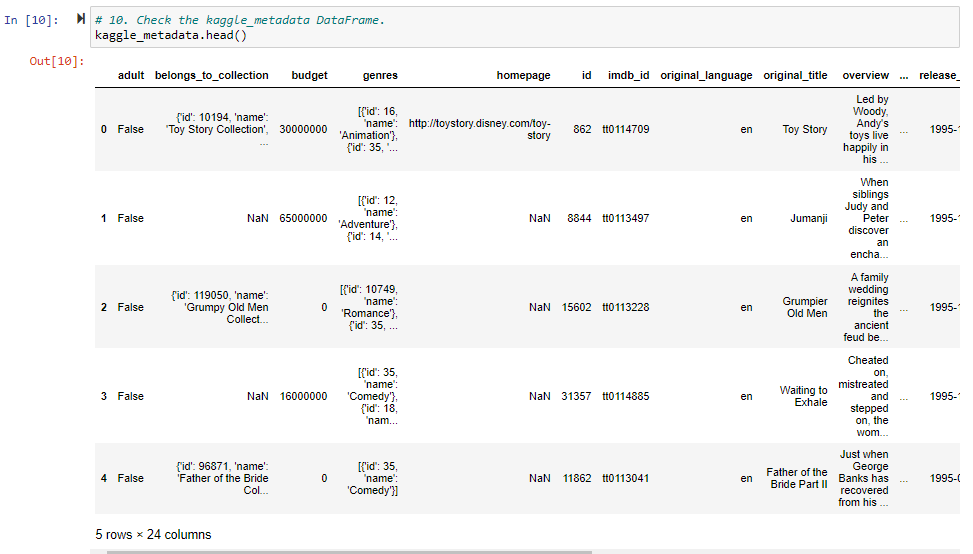
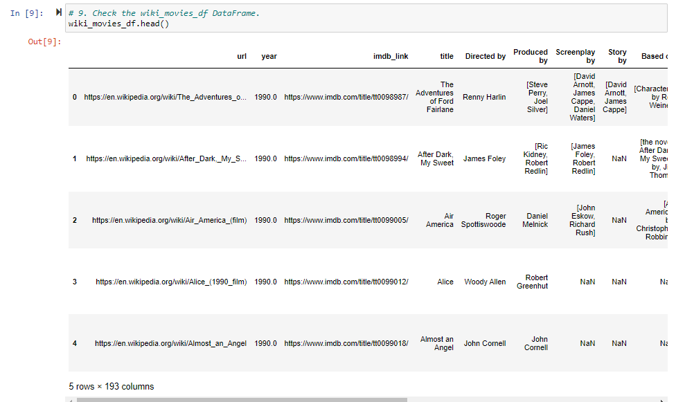
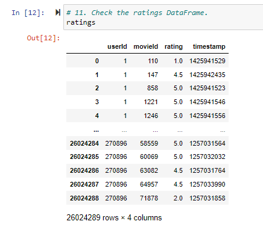
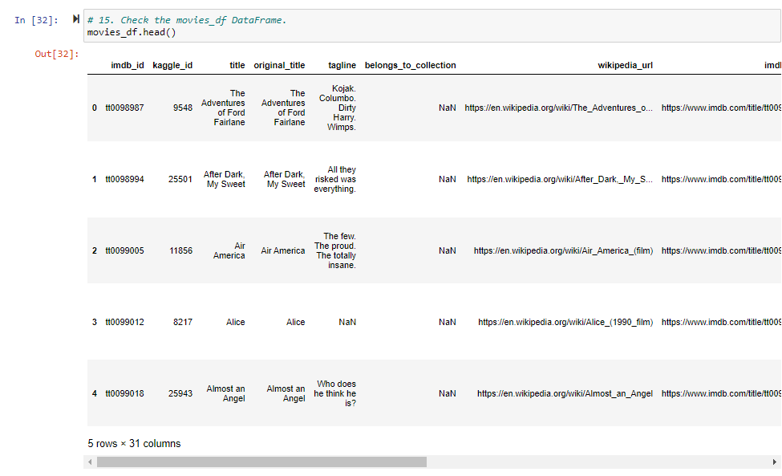
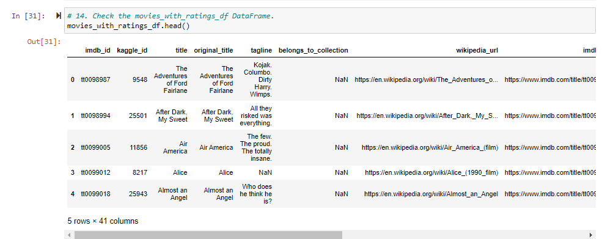
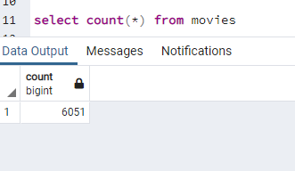
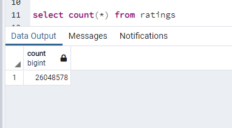

# Movies-ETL

## Using the ETL (Extract, Transform, Load) process to import, clean and transform big data into an SQL database with Python, Pandas, and PostgreSQL. 

### Purpose

The purpose of this project is to create an automated pipeline from raw data that imports new data, applies a series of specified transformations that clean and format the data, and load it into existing tables within an SQL database. A function was written that read three separate data files: a JSON file containing miscellaneous Wikipedia movie data, a CSV file containing the MovieLens dataset (20,000,000 film ratings), and a CSV file containing movie metadata from 45,000 movies rated within the MovieLens dataset. 

### Datasets:
*	Wikipedia-movies.json, 6.02 MB, downloaded from Wikipedia.com
*	Ratings.csv (MovieLens Data Set), 692.92 MB, downloaded from Kaggle.com
* Movies_metadata.csv, 33.64 MB, downloaded from Kaggle.com

### Resources:
* Python 3.7.9 (Dependencies: Pandas, NumPy, SQLalchemy, Psycopg2)
*	PostgreSQL 11.16
*	Conda 4.13.0
*	Anaconda Navigator 2.2.7
*	Jupyter Notebook 6.4.8
*	pgAdmin 4, Version 6.8

### Overview

In the ETL_function_test.ipynb script, data was extracted from JSON and CSV files downloaded from Wikipedia.com and Kaggle.com. Using Python, Jupyter Notebook and the Pandas dependency, the data was transformed into Pandas data frames.

In the ETL_clean_wiki_movies.ipynb script, the data was cleaned and formatted using functions that include but are not limited to Python list comprehensions, regular expressions, and lambda functions. Scattered data in alternate languages was moved into one column, alt titles and column names were changed for clarity and consistency. Below are screenshots of the transformed data frames. 

#### Kaggle Metadata Data frame:

#### Wiki Data Frame:

#### Ratings Data Frame:

In the ETL_clean_kaggle_data.ipynb script, the extract_transform_load function was updated to clean the Kaggle data by changing datatypes, filling in missing values, filtering unwanted columns and merging data frames. Below are screenshots of the edited dataframes. 

#### Movies Data Frame

#### Movies With Ratings Data Frame

Lastly, In the ETL_create_database.ipynb script, the data was connected to a SQL database using the Sqlalchemy library. The complete process was rendered so it could be executed in a single function, the extract_transform_load call. In pgAdmin, both the updated movies and ratings tables were imported with the transformed data. Below are screenshots of the results produced when the SELECT COUNT(*) query was ran on both tables. 

#### Movies Query

#### Ratings Query

